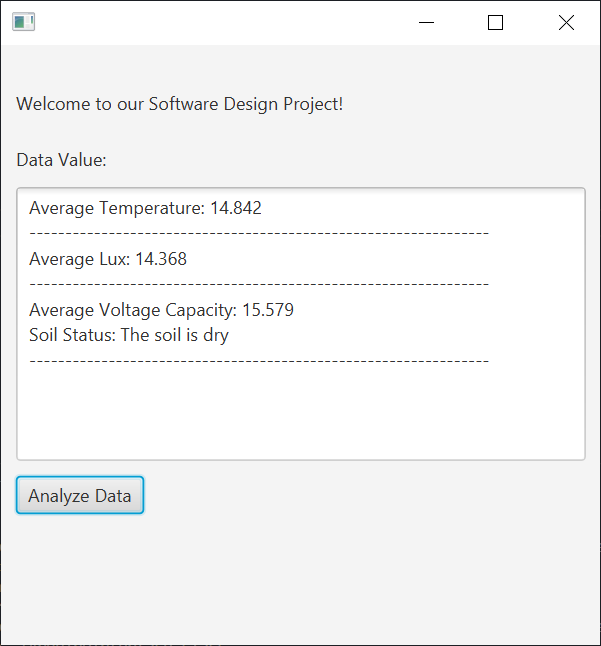

# Arduino Light and Moisture Sensor
Welcome to the Arduino Light and Moisture Sensor! 

The purpose of this project is to provide a simple tool for gardeners to measure and track the environmental conditions in their gardens. The sensors provide three sets of data: temperature, luminosity, and moisture. The average of each of these is reported through the JavaFX graphical interface, and if further analysis is desired, an Excel spreadsheet containing all the data collected is also generated so that more specific analysis on the data collected can be done. 


# How to run
- Download the latest release from the releases tab on the right side of the page

- Connect an Arduino to your computer and using a tool such as Arduino IDE upload the soilAndLight folder containing the soilAndLight sketch to the Arduino

- With the Arduino connected to your computer, check the connected devices to see which COM the Arduino is connected to
    + if it is any COM port other than COM3, then the value 'COM3' on line 6 of ReadSensor.py will have to be changed to whichever COM port your Arduino is connected to

- Ensure that the Arduino IDE (or any analoguous tool used to upload the sketch) is closed, as it will interfere with the ability to collect data directly from the Arduino

- From the command line, navigate to the downloaded release folder
- Run ArduinoInterface.jar
```
java -jar ArduinoInterface.jar
```
- This will automatically start the scripts necessary for collecting data from the Arduino
- Alternatively, a tool such as [Launch4j](https://launch4j.sourceforge.net/) can be used to package the jar into an executable

- In either case, this file must be run from the same directory containing the Python scripts ReadSensor.py and SensorDataToExcel.py, or else the scripts will not run

# How to contribute
- You must have a branch assigned to you before you can start contributing
    + Please reach out to one of the people already working on this project to have a branch created for you
- The current goal is to get data from the Arduino transferring to a computer over Wi-Fi
    + This will mainly involve modifications to soilAndLight.ino and ReadSensor.py
### Required Hardware
```
Arduino Uno
BH1750 Light Sensor
AdaFruit Seesaw 
Wi-Fi module (TBA)
```

### How to Build   
- Use this github repository: https://github.com/cis3296s23/05-arduino-light-and-water-sensor
- Compile launcher.java into a .jar file
    + This requires linking the JavaFX library
        - The easiest way to do this is to use the full JDK provided by [BellSoft](https://bell-sw.com/pages/downloads/)
    + If you would like to bundle the JavaFX library directly into the jar, that can be done using Intellij (NOTE: this is the method required if you want to bundle the jar into an executable)
        - When using this method, it is still easiest to create the project using the BellSoft JDK, then compile it into a jar by going to File -> Project Structure -> Artifacts -> from module with dependencies, then click apply and next
        - Then navigate to Build -> Artifacts and build the .jar
        - The jar output will have the JavaFX libraries compiled with it
### Commandline method - easiest if you don't intend on bundling it into an executable
- First ArduinoInterface.java must be compiled into a class file      
```
javac ArduinoInterface.java  
```
- Then the class file must be compiled into an executable .jar file
```
jar cvfe ArduinoInterface.jar ArduinoInterface ArduinoInterface.class
```
- At this point you should be greeted with an interface similar to the one at the top of this README 
- No changes are being made to the GUI at this time, so it can be used to test changes made to soilAndLight.ino and ReadSensor.py. Because of the way the GUI functions, there is no need to recompile it after changing either of the previously mentioned files
